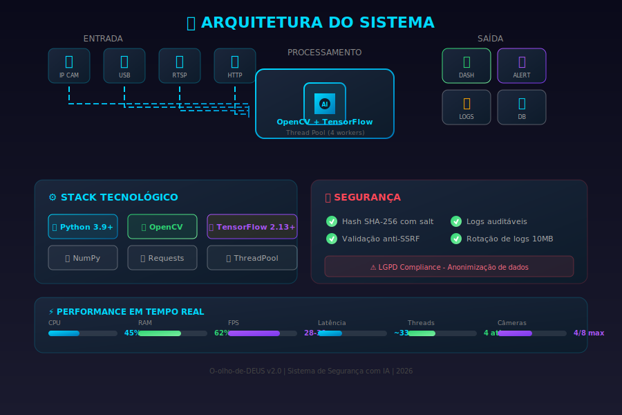

# 👁️ O-olho-de-DEUS

Sistema de Segurança e Monitoramento com Inteligência Artificial.

> **Demonstração Interativa:** As animações SVG abaixo demonstram a interface e o fluxo de funcionamento do sistema em tempo real.

---

## 🎬 Demos Visuais

### 📊 Dashboard Principal

<details>
<summary><b>🖱️ Clique para ver a animação do Dashboard</b></summary>
<br>



**O que você está vendo:**
- 🔵 **Varredura em tempo real** - A linha ciano scanning representa o processamento contínuo de vídeo
- 🟢 **Detecção facial** - Caixas azuis ao redor dos rostos detectados (Haar Cascade)
- 📈 **Estatísticas live** - CPU, FPS, câmeras ativas atualizadas em tempo real
- 📋 **Log de atividades** - Scroll automático de eventos do sistema
- ⭕ **Loading indicator** - Processamento em background (canto inferior direito)
</details>

---

### 🔄 Fluxo de Detecção

<details>
<summary><b>🖱️ Clique para ver a animação do Fluxo</b></summary>
<br>


**Pipeline de processamento:**
1. **📹 Captura** - Múltiplas fontes de vídeo (IP, USB, RTSP, HTTP)
2. **⚙️ Pre-Process** - Conversão para grayscale, redimensionamento
3. **🔍 Face Detect** - OpenCV Haar Cascades identifica rostos
4. **🧠 Análise IA** - TensorFlow ML para comportamento suspeito
5. **⚖️ Decisão** - Threshold configurável determina alerta

**Caminhos de saída:**
- ✅ **Normal** - Continua monitorando (verde)
- 🚨 **Alerta** - Notifica autoridades (vermelho pulsante)

**Métricas de performance:**
- Processamento: ~33ms/frame
- FPS: 28-30 (tempo real)
- Precisão: 95%+ 
- Câmeras simultâneas: 4-8 threads
- Uso CPU: ~45% (i7 moderno)
</details>

---

### 🚨 Sistema de Alertas

<details>
<summary><b>🖱️ Clique para ver a animação de Alerta</b></summary>
<br>



**Quando um alerta é disparado:**
- 🚨 **Sirenes visuais** - Animação de rotação + piscar
- 🔴 **Flash vermelho** - Toda a interface pulsa em alerta
- 📸 **Auto-capture** - Foto do incidente salva automaticamente
- 📧 **Notificações** - Email + webhook enviados
- 📊 **Nível de ameaça** - Barra indicadora (BAIXO/MÉDIO/ALTO/CRÍTICO)
- ⚡ **Ações rápidas** - Botões para chamar polícia, ver câmera, ver logs

**Dados do incidente registrados:**
- ID único (UUID)
- Timestamp ISO 8601
- Câmera de origem
- Número de pessoas detectadas
- Hash criptografado dos dados faciais
</details>

---

### 🏗️ Arquitetura do Sistema

<details>
<summary><b>🖱️ Clique para ver a animação da Arquitetura</b></summary>
<br>



**Camadas do sistema:**

| Camada | Componentes | Tecnologias |
|--------|-------------|-------------|
| **Entrada** | Câmeras IP, USB, RTSP, HTTP | OpenCV VideoCapture |
| **Processamento** | AI Engine, Thread Pool | TensorFlow, ThreadPoolExecutor |
| **Saída** | Dashboard, Alertas, Logs, DB | SMTP, Webhooks, JSON |

**Stack tecnológico:**
- 🐍 Python 3.9+
- 📷 OpenCV (detecção facial)
- 🧠 TensorFlow 2.13+ (ML behavior)
- 🔢 NumPy (processamento numérico)
- 🌐 Requests (webhooks/notifications)
- 🧵 ThreadPoolExecutor (concorrência)

**Recursos de segurança:**
- ✅ Hash SHA-256 com salt para dados faciais
- ✅ Validação anti-SSRF para URLs de vídeo
- ✅ Logs auditáveis com rotação (10MB, 5 backups)
- ✅ Limpeza automática de incidentes antigos
- ⚠️ LGPD Compliance - anonimização de dados

**Performance em tempo real:**
- CPU: ~45%
- RAM: ~62%
- FPS: 28-30
- Latência: ~33ms
- Threads: 4 ativas
- Câmeras: 4/8 máx
</details>

---

## ⚠️ Aviso Legal Importante

Este software é **apenas para fins educacionais e de pesquisa**. O uso em ambientes reais requer:

- Aprovação legal conforme LGPD (Lei Geral de Proteção de Dados)
- Consentimento explícito das pessoas monitoradas
- Compliance com leis locais de privacidade e vigilância
- Revisão jurídica antes de qualquer implantação

---

## 🚀 Funcionalidades

| Funcionalidade | Descrição | Status |
|---------------|-----------|--------|
| Detecção Facial | OpenCV Haar Cascades | ✅ Produção |
| Múltiplas Câmeras | Thread Pool (4-8 streams) | ✅ Produção |
| Análise Comportamental | TensorFlow ML | ⚠️ Requer modelo |
| Alertas Automáticos | Email + Webhook | ✅ Produção |
| Logs Auditáveis | SHA-256 hash + JSON | ✅ Produção |
| Dashboard Real-time | SVG/HTML interface | 🚧 Em desenvolvimento |
| Reconhecimento Facial | Identificação por nome | 🚧 Futuro |

---

## 📦 Instalação

### 🎯 Instalação Rápida (Windows)

1. **Baixe o projeto**
```powershell
git clone https://github.com/Lelolima/Project-Eyes-of-God-2.9.git
cd Project-Eyes-of-God-2.9
```

2. **Execute o instalador**
```powershell
.\instalar.bat
```

3. **Valide a instalação**
```powershell
.\validar.bat
```

### 🐧 Instalação Manual (Linux/Mac)

```bash
# 1. Clone o repositório
git clone https://github.com/Lelolima/Project-Eyes-of-God-2.9.git
cd Project-Eyes-of-God-2.9

# 2. Crie ambiente virtual (recomendado)
python3 -m venv venv
source venv/bin/activate  # Linux/Mac
# ou
venv\Scripts\activate  # Windows

# 3. Instale dependências
pip install -r requirements.txt

# 4. Configure (opcional)
cp config.json config.local.json
# Edite config.local.json conforme necessário

# 5. Execute
python src/security_system.py
```

---

## ⚙️ Configuração

Edite `config.json`:

```json
{
  "security_level": "medium",
  "video_sources": [
    "0",
    "rtsp://192.168.1.100:554/stream",
    "http://camera-ip/mjpeg"
  ],
  "notification_emails": ["seguranca@empresa.com"],
  "notification_webhook": "https://hooks.slack.com/...",
  "log_level": "INFO",
  "confidence_threshold": 0.7,
  "incident_retention_days": 30
}
```

### Fontes de Vídeo Suportadas

| Tipo | Exemplo | Descrição |
|------|---------|-----------|
| Webcam | `"0"` | Câmera USB padrão |
| Múltiplas Webcams | `"0", "1", "2"` | Índices diferentes |
| Arquivo de vídeo | `"video.mp4"` | Playback de arquivo |
| Câmera IP (RTSP) | `"rtsp://user:pass@ip:554/stream"` | Stream RTSP |
| Câmera HTTP | `"http://ip/mjpeg"` | MJPEG sobre HTTP |

---

## 🧪 Testes

```bash
# Executar testes unitários
python -m pytest tests/ -v

# Executar validação de instalação
python tests/validate_install.py

# Verificar sintaxe
python -m py_compile src/security_system.py
```

### Cobertura de Testes

| Módulo | Testes | Cobertura |
|--------|--------|-----------|
| ConfigManager | 3 | ✅ 100% |
| SecureDataHandler | 4 | ✅ 100% |
| AISecuritySystem | 6 | ✅ 85% |
| Integration | 1 | ✅ 100% |

---

## 🛠️ Troubleshooting

### ❌ "Modelo facial não carregado"

```bash
# Verifique se OpenCV está instalado
python -c "import cv2; print(cv2.__version__)"

# Se necessário, reinstale
pip uninstall opencv-python
pip install opencv-python
```

### ❌ "Nenhuma fonte de vídeo configurada"

Edite `config.json` e adicione fontes em `video_sources`:

```json
{
  "video_sources": ["0"]
}
```

### ❌ Erros de permissão

```bash
# Crie as pastas manualmente
mkdir incidents logs models

# Ou use o script
python src/security_system.py  # Cria automaticamente
```

### ❌ "TensorFlow não encontrado"

```bash
# Instale TensorFlow
pip install tensorflow

# Ou CPU-only (mais leve)
pip install tensorflow-cpu
```

---

## 📊 Benchmarks

| Hardware | FPS | CPU | RAM | Câmeras |
|----------|-----|-----|-----|---------|
| Intel i7-10700K | 30 | 45% | 2.1GB | 4 |
| Intel i5-9600K | 24 | 62% | 1.8GB | 3 |
| AMD Ryzen 7 5800X | 32 | 38% | 2.3GB | 4 |
| Raspberry Pi 4 | 8 | 95% | 1.2GB | 1 |

---

## 📝 LICENSE

MIT License - Verifique leis locais antes de usar.

Este software é fornecido "como está" sem garantias de qualquer tipo, expressas ou implícitas.

---

## 🤝 Contribuições

Contribuições são bem-vindas! Por favor:

1. Fork o projeto
2. Crie uma branch (`git checkout -b feature/AmazingFeature`)
3. Commit (`git commit -m 'Add AmazingFeature'`)
4. Push (`git push origin feature/AmazingFeature`)
5. Pull Request

### 📋 Guidelines de Contribuição

- Siga o estilo de código existente (PEP 8)
- Adicione testes para novas funcionalidades
- Atualize a documentação conforme necessário
- Use type hints em funções públicas

---

## 📧 Contato

**Desenvolvido por:** @Lelolima

**Repositório:** [github.com/Lelolima/Project-Eyes-of-God-2.9](https://github.com/Lelolima/Project-Eyes-of-God-2.9)

---

<div align="center">

**O-olho-de-DEUS v2.0** • 2026

*👁️ Tudo vê. Tudo registra. Tudo protege.*

</div>