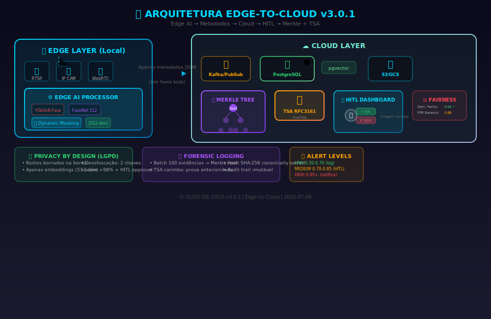

# 🎨 Assets do Projeto Olho de Deus v3.0.1

Este diretório contém os diagramas SVG animados que documentam a arquitetura e o fluxo do sistema.

---

## 📊 Diagramas Disponíveis

### 1. `arquitetura-edge-cloud.svg`
**Arquitetura Edge-to-Cloud completa**



**Componentes mostrados:**
- 📡 **Edge Layer**: Câmeras RTSP → Edge AI Processor (YOLOv8-Face + FaceNet) → Dynamic Masking
- ☁️ **Cloud Layer**: Kafka/PubSub → PostgreSQL + pgvector → S3/GCS
- 🔒 **Forensic**: Merkle Tree + Timestamp Authority (RFC 3161)
- 🖥️ **HITL Dashboard**: Triagem humana com WebSocket
- ⚖️ **Fairness Monitor**: Demographic parity, FPR balance

**Animações:**
- Pulse nas bordas (Edge AI)
- Flow de dados com linhas tracejadas
- Merkle Tree com glow roxo
- TSA com flash laranja
- DB com write animation

---

### 2. `fluxo-edge-detection.svg`
**Pipeline de detecção na borda**


**Etapas:**
1. 📡 **Streams RTSP**: 4-8 câmeras simultâneas
2. 🎯 **YOLOv8-Face**: Detecção facial em tempo real (30 FPS)
3. 🧠 **FaceNet 512**: Extração de embeddings (512-dim vector)
4. 🔒 **Dynamic Masking**: Gaussian Blur σ=99 (Privacy by Design)
5. 📄 **Metadata JSON**: Apenas metadados sobem para cloud (sem frame bruto)
6. ⚖️ **Threshold Decision**: LOW (drop) | MEDIUM (log) | HIGH (cloud + HITL)

**Performance:**
- 30 FPS @ 1080p
- ~33ms latency
- 99% menor banda (sem frames brutos)

---

### 3. `dashboard-hitl.svg`
**Interface do painel HITL (Human-in-the-Loop)**



**Funcionalidades:**
- 🔔 **WebSocket**: Alertas push em tempo real
- 📊 **Fila de Alertas**: Priorização por score
- 📈 **Estatísticas 24h**: Total, revisados, escalonados, descartados
- ⚖️ **Fairness Widget**: Monitoramento contínuo de viés
- 🔒 **Two-Key Unblur**: score ≥ 0.98 + HITL approve

**Atalhos de teclado:**
- `E`: Escalar (notificar authorities)
- `D`: Descartar (falso positivo)
- `U`: Unblur (requer duas chaves)
- `L`: Ver logs forenses

---

### 4. `alerta-seguranca-v3.svg`
**Fluxo de alerta de segurança**



**Pipeline:**
1. 📹 **Detecção**: YOLOv8-Face identifica rostos
2. 🧠 **Edge AI**: FaceNet extrai embeddings
3. ⚖️ **Threshold**: score ≥ 0.85 dispara alerta
4. 👤 **HITL Review**: Operador valida antes de notificar
5. 🔔 **Notifica**: Authorities + Logs forenses

**Métricas:**
- Tempo de detecção: ~33ms
- Threshold padrão: 0.85
- Review HITL médio: ~23s
- Precisão (24h): 19% (8 true positives / 47 total)

---

## 🔧 Como Usar

### Incorporar em Documentação

```markdown

```

### Visualizar no Browser

Basta abrir o arquivo `.svg` em qualquer navegador moderno. As animações CSS são suportadas nativamente.

### Editar

Os SVGs são editáveis em:
- **Figma**: Importar como SVG
- **Inkscape**: Editor gratuito e open-source
- **VS Code**: Editar diretamente o XML + CSS

### Estilos Comuns

Todos os diagramas usam:
- Gradientes consistentes (`edgeGrad`, `cloudGrad`, `dangerGrad`, etc.)
- Mesmas famílias de fontes (`Segoe UI`, `Consolas` para código)
- Animações sincronizáveis (pulse, flow, glow)

---

## 📐 Especificações Técnicas

| Diagrama | Dimensões | Cores Principais |
|----------|-----------|------------------|
| arquitetura-edge-cloud | 1000x650 | #00d9ff (cyan), #a855f7 (purple) |
| fluxo-edge-detection | 1000x550 | #ff4757 (red), #2ed573 (green) |
| dashboard-hitl | 1000x600 | #00d9ff (cyan), #ffa502 (orange) |
| alerta-seguranca-v3 | 1000x650 | #ff4757 (red), #2ed573 (green) |

---

## 🎯 Diferenças v2.0 vs v3.0.1

| Aspecto | v2.0 (LEGADO) | v3.0.1 (ATUAL) |
|---------|---------------|----------------|
| **Processamento** | Centralizado (OpenCV + Haar) | Edge AI (TensorRT/OpenVINO) |
| **Dados na Cloud** | Frames brutos | Apenas metadados JSON |
| **Reconhecimento** | Haar Cascade | YOLOv8-Face + FaceNet 512 |
| **Privacidade** | Sem blur dinâmico | Dynamic Masking na borda |
| **Cadeia Custódia** | Hash SHA-256 simples | Merkle Tree + TSA RFC 3161 |
| **Notificação** | Automática (sem HITL) | HITL obrigatório antes de authorities |
| **Fairness** | N/A | Monitoramento contínuo (demographic parity) |
| **Threshold** | Fixo | Dinâmico com histerese |

---

## 🔐 Privacy by Design

Todos os diagramas destacam que:
- ✅ Rostos são borrados **na borda** antes de sair do NVR local
- ✅ Apenas **embeddings (512 floats)** são enviados para cloud
- ✅ **Desofuscação** requer duas chaves: score ≥ 0.98 + approval HITL
- ✅ **Nenhum frame bruto** deixa a borda sem authorization

---

## 📅 Atualização

- **Data:** 2026-07-04
- **Versão:** 3.0.1
- **Autor:** Claude Opus 4.8

---

**Legado v2.0:** Os diagramas antigos estão em `LEGADO_v2.0.0/assets/` para referência histórica.